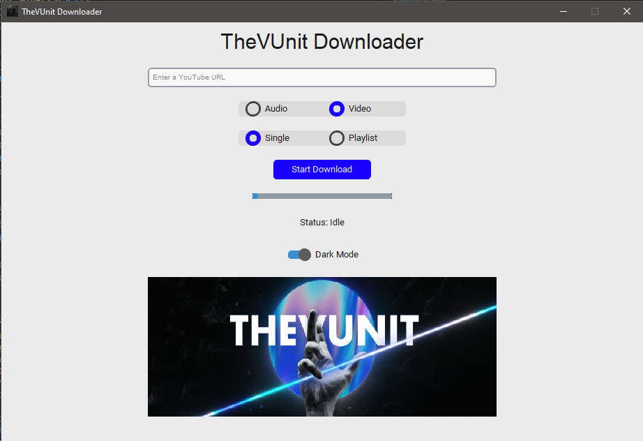

# TheVUnit Downloader
TheVUnit Downloader is a downloading tool made to let you download things easily on social media. Made with ❤ by Ahad#3257

This is beta version if you find any errors or you have ideas make issues and let me know.

# How To Use?
> [!WARNING]
> DON'T DELETE ANY FOLDER OR ITS CONTENT

You can just download this repo and run `TheVUnit Downloader.exe` or you can follow the steps below:

It's very simple just follow the steps written below.

Type `pip install -r requirements` to install all required modules

Type `py app.py` in console to launch YouTube Video Downloader Tool.

Provide URL of a video on YouTube.

# Features:

- [x] YouTube videos downloading support.
- [ ] Other social media support (tiktok, insta, facebook e.t.c)
- [ ] Quality options.
- [x] Playlist support.
- [ ] AutoUpdate support.
- [ ] GUI upgrade.

# Light and Dark mode:
***

***

# Note:
Use it but please give credits to author.

Skidding this code is not allowed if you see anyone taking credits of this script dm me on discord.

# Social Media:
[Instagram](https://www.instagram.com/ahadnoor._) ・
[Discord](https://discord.gg/Ncsc5pRNgf) ・
[Website](https://www.itscruel.cf/) 

# Discord: Ahad#3257
If you liked this repo please don't forget to give it a star it would mean a lot.
